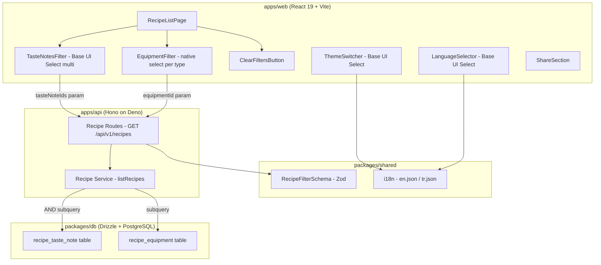

# Design Document: Recipe UI Improvements

## Overview

This design covers a set of coordinated UI improvements across the BrewForm web application. The changes span the recipe list page (multi-select taste notes filter, equipment filter verification, clear button repositioning), the Navbar (theme switcher label fix), the Footer (language selector restyling), and the recipe detail page (share section layout simplification). A small API change supports multi-taste-note filtering.

The guiding principle is consistency: all dropdowns use Base UI Select, all styling uses Tailwind CSS 4 utility classes (no inline styles), and all user-facing text is internationalized.

## Architecture



### Key Architectural Decisions

1. **Base UI Select for multi-select** — The `multiple` prop on `Select.Root` provides built-in multi-selection with checkbox indicators. No need for a custom multi-select implementation.

2. **API parameter change: `tasteNoteId` → `tasteNoteIds`** — The existing single-value `tasteNoteId` parameter is replaced with a comma-separated `tasteNoteIds` parameter (max 10 UUIDs). The API applies AND logic via intersecting subqueries.

3. **No new components for equipment filters** — Equipment filters remain as native `<select>` elements since they are single-select and already work correctly. Only verification and minor correctness fixes are needed.

4. **URL as source of truth for filter state** — All filter state lives in URL search params, making filtered views shareable and bookmarkable.

## Components and Interfaces

### TasteNotesFilter (new component)

Extracted from `RecipeListPage.tsx` into `apps/web/src/components/recipe/TasteNotesFilter.tsx`.

```typescript
interface TasteNotesFilterProps {
  allTasteNotes: TasteNoteFlat[];
  selectedIds: string[];
  onChange: (ids: string[]) => void;
  placeholder: string;
}
```

Uses `Select.Root` with `multiple` prop. The `Select.Value` renders a custom function showing either the placeholder or a count label (e.g., "3 selected"). Taste notes are grouped by depth-0 root categories using `Select.Group` with `Select.GroupLabel` for non-selectable headers.

Key implementation details from Base UI docs:
- `<Select.Root multiple value={selectedIds} onValueChange={handleChange}>`
- `<Select.Value>{renderValue}</Select.Value>` where `renderValue` is a function receiving the array of selected values
- `alignItemWithTrigger={false}` on `Select.Positioner` for multi-select (recommended by Base UI)
- Each selectable item uses `Select.Item` with `Select.ItemIndicator` showing a checkmark

### LanguageSelector (refactored component)

Replaces the native `<select>` in `Footer.tsx` with a Base UI Select matching the ThemeSwitcher pattern.

```typescript
interface LanguageSelectorProps {
  locale: string;
  setLocale: (locale: 'en' | 'tr') => void;
  availableLocales: string[];
}
```

Locale display labels are hardcoded in the component (not from i18n):
- `en` → `"🇬🇧 English"`
- `tr` → `"🇹🇷 Türkçe"`

### ThemeSwitcher (fix)

The current implementation uses `<Select.Value />` which renders the raw value string. The fix passes a render function to `Select.Value` that maps the current theme value to its translated label:

```tsx
<Select.Value>
  {(value: string) => t(`theme.${value}`) || value}
</Select.Value>
```

This ensures the trigger always shows the translated label ("Light Roast", not "light").

### ShareSection (simplified layout)

Remove the `div[role="textbox"]` URL display element. The layout becomes:
- Flex container: `flex-col sm:flex-row`
- Left: QR code image (128×128px)
- Right column:
  - Row 1: "Copy URL" + "Download QR" buttons
  - Row 2: X/Twitter + Facebook + WhatsApp buttons

### ClearFiltersButton (repositioned)

Moved from the bottom of the filter sidebar to immediately after the "Filters" heading. Visibility logic unchanged: shown when any filter parameter differs from its default value.

### RecipeListPage (updated filter logic)

- Replace single `tasteNoteId` state with `tasteNoteIds` (array from URL, comma-separated)
- Pass `tasteNoteIds` to API as comma-separated string
- Limit to 10 selected taste notes (UI enforces this)
- Update `updateFilter` to handle array-valued params
- Add `hasActiveFilters` computed boolean for clear button visibility

## Data Models

### URL Query Parameters (Frontend)

| Parameter | Type | Default | Description |
|-----------|------|---------|-------------|
| `brewMethod` | string | `""` | Brew method enum value |
| `drinkType` | string | `""` | Drink type enum value |
| `visibility` | string | `""` | Visibility (admin only) |
| `equipmentId` | UUID string | `""` | Single equipment item ID |
| `tasteNoteIds` | comma-separated UUIDs | `""` | Up to 10 taste note IDs (AND logic) |
| `search` | string | `""` | Free-text search |
| `sortBy` | `createdAt\|likeCount\|rating` | `createdAt` | Sort field |
| `page` | number | `1` | Current page |

### API Query Parameters (Backend)

Updated `RecipeFilterSchema` in `packages/shared/src/schemas/recipe.ts`:

```typescript
export const RecipeFilterSchema = z.object({
  brewMethod: BrewMethodEnum.optional(),
  drinkType: DrinkTypeEnum.optional(),
  visibility: VisibilityEnum.optional(),
  authorId: z.string().uuid().optional(),
  equipmentId: z.string().uuid().optional(),
  tasteNoteIds: z.string().optional().refine(
    (val) => {
      if (!val) return true;
      const ids = val.split(',');
      if (ids.length > 10) return false;
      return ids.every((id) => /^[0-9a-f]{8}-[0-9a-f]{4}-[0-9a-f]{4}-[0-9a-f]{4}-[0-9a-f]{12}$/i.test(id.trim()));
    },
    { message: 'tasteNoteIds must be at most 10 comma-separated UUIDs' }
  ),
  // Keep tasteNoteId for backward compatibility (deprecated)
  tasteNoteId: z.string().uuid().optional(),
  grinder: z.string().optional(),
  search: z.string().optional(),
  page: z.coerce.number().int().positive().default(1),
  perPage: z.coerce.number().int().positive().max(100).default(20),
  sortBy: z.enum(['createdAt', 'likeCount', 'rating']).default('createdAt'),
  sortOrder: z.enum(['asc', 'desc']).default('desc'),
});
```

### API Service Change (Backend)

In `apps/api/src/modules/recipe/service.ts`, the `listRecipes` function adds support for `tasteNoteIds`:

```typescript
if (filters.tasteNoteIds) {
  const ids = filters.tasteNoteIds.split(',').map((id: string) => id.trim());
  // AND logic: recipe's current version must have ALL specified taste notes
  for (const noteId of ids) {
    conditions.push(
      inArray(
        recipes.currentVersionId,
        db.select({ id: recipeTasteNotes.recipeVersionId })
          .from(recipeTasteNotes)
          .where(eq(recipeTasteNotes.tasteNoteId, noteId)),
      ),
    );
  }
} else if (filters.tasteNoteId) {
  // Backward compatibility: single taste note filter
  conditions.push(
    inArray(
      recipes.currentVersionId,
      db.select({ id: recipeTasteNotes.recipeVersionId })
        .from(recipeTasteNotes)
        .where(eq(recipeTasteNotes.tasteNoteId, filters.tasteNoteId)),
    ),
  );
}
```

### Database Schema

No schema changes required. The existing `recipe_taste_note` junction table already supports the AND query pattern via multiple `inArray` subqueries.

### i18n Keys (New)

Added to `packages/shared/src/i18n/en.json`:
```json
{
  "recipe.list.tasteNotesFilter": "Taste Notes",
  "recipe.list.tasteNotesPlaceholder": "Select taste notes...",
  "recipe.list.tasteNotesSelected": "{count} selected",
  "recipe.list.tasteNotesMax": "Maximum 10 taste notes",
  "preferences.locale": "Language"
}
```

Corresponding Turkish translations in `tr.json`:
```json
{
  "recipe.list.tasteNotesFilter": "Tat Notaları",
  "recipe.list.tasteNotesPlaceholder": "Tat notası seçin...",
  "recipe.list.tasteNotesSelected": "{count} seçili",
  "recipe.list.tasteNotesMax": "En fazla 10 tat notası",
  "preferences.locale": "Dil"
}
```

## Correctness Properties

*A property is a characteristic or behavior that should hold true across all valid executions of a system — essentially, a formal statement about what the system should do. Properties serve as the bridge between human-readable specifications and machine-verifiable correctness guarantees.*

### Property 1: Taste note hierarchy rendering

*For any* set of taste notes with varying depths (0, 1, 2), when rendered in the TasteNotesFilter, all depth-0 nodes SHALL appear as non-selectable group headers and all depth-1 and depth-2 nodes SHALL appear as selectable items.

**Validates: Requirements 1.2**

### Property 2: AND logic filtering

*For any* set of recipes with taste note assignments and *for any* subset of selected taste note IDs, the filtered result SHALL contain only recipes whose current version contains ALL of the selected taste note IDs.

**Validates: Requirements 1.3**

### Property 3: Taste note IDs URL round-trip

*For any* set of 1–10 valid UUIDs representing selected taste notes, serializing them to the URL query parameter `tasteNoteIds` as a comma-separated string and then parsing that string back SHALL produce the same set of UUIDs.

**Validates: Requirements 1.4, 1.9**

### Property 4: Trigger label reflects selection count

*For any* number of selected taste notes N (where 0 ≤ N ≤ 10), the TasteNotesFilter trigger SHALL display the placeholder text when N = 0, and SHALL display a count label containing N when N > 0.

**Validates: Requirements 1.6**

### Property 5: Equipment grouping correctness

*For any* list of equipment items with varying types, grouping by type SHALL produce exactly one non-empty bucket per distinct type present, and the number of rendered equipment filter dropdowns SHALL equal the number of non-empty buckets.

**Validates: Requirements 2.1, 2.2**

### Property 6: UUID validation prevents invalid filter params

*For any* string that does not match the UUID format (`/^[0-9a-f]{8}-[0-9a-f]{4}-[0-9a-f]{4}-[0-9a-f]{4}-[0-9a-f]{12}$/i`), the RecipeListPage SHALL NOT include that string as an `equipmentId` parameter in API requests.

**Validates: Requirements 2.6**

### Property 7: Clear button visibility reflects filter state

*For any* combination of filter parameter values, the "Clear Filters" button SHALL be visible if and only if at least one filter parameter differs from its default value (brewMethod="", drinkType="", visibility="", equipmentId="", tasteNoteIds="", search="", sortBy="createdAt").

**Validates: Requirements 3.1, 3.2**

### Property 8: Theme switcher displays translated labels

*For any* theme value in {light, dark, coffee} and *for any* locale in {en, tr}, the ThemeSwitcher trigger SHALL display the value returned by `t('theme.{value}')` and SHALL NOT display the raw theme value string, provided the translation returns a non-empty string.

**Validates: Requirements 4.5**

### Property 9: Translation key parity

*For any* key present in `en.json`, a corresponding key SHALL exist in `tr.json`, ensuring 1:1 key parity between locale files.

**Validates: Requirements 9.1**

## Error Handling

| Scenario | Handling |
|----------|----------|
| Equipment API fetch fails | Hide all equipment filter dropdowns; log error; do not block page load |
| Taste notes API fetch fails | Hide taste notes filter; log error; do not block page load |
| Clipboard write fails (ShareSection) | Show error state text for 3 seconds, then revert to default label |
| `tasteNoteIds` contains invalid UUIDs | Schema validation rejects at API level; frontend validates before sending |
| `tasteNoteIds` exceeds 10 items | Frontend enforces max 10 selections; API schema rejects if >10 |
| Translation key missing from tr.json | Runtime fallback to English value (existing i18n behavior) |
| Empty `availableLocales` array | Language selector does not render |

## Testing Strategy

### Testing Framework

- **Unit/Component tests**: Vitest + @testing-library/react + jsdom
- **Property-based tests**: fast-check (already in devDependencies)
- **Test location**: Co-located with source files (e.g., `TasteNotesFilter.test.tsx`)

### Dual Testing Approach

**Property-based tests** verify universal correctness properties (Properties 1–9 above) with minimum 100 iterations each. These cover the core logic: filtering, serialization, grouping, validation, and i18n parity.

**Example-based unit tests** cover:
- Specific UI interactions (select/deselect taste notes, click clear button)
- Edge cases (empty results, API failures, clipboard errors)
- Rendering checks (correct DOM structure, ARIA attributes, responsive classes)
- Integration points (API call parameters, URL synchronization)

### Property Test Configuration

- Library: `fast-check` v3.22.0
- Minimum iterations: 100 per property
- Tag format: `Feature: recipe-ui-improvements, Property {N}: {title}`

Each property test references its design document property:

```typescript
// Feature: recipe-ui-improvements, Property 2: AND logic filtering
it('should only include recipes containing ALL selected taste notes', () => {
  fc.assert(
    fc.property(
      arbitraryRecipesWithTasteNotes,
      arbitrarySelectedNoteIds,
      (recipes, selectedIds) => {
        const filtered = filterByTasteNotes(recipes, selectedIds);
        return filtered.every(recipe =>
          selectedIds.every(id => recipe.tasteNoteIds.includes(id))
        );
      }
    ),
    { numRuns: 100 }
  );
});
```

### Test Coverage Plan

| Component | Property Tests | Example Tests |
|-----------|---------------|---------------|
| TasteNotesFilter | P1 (hierarchy), P4 (trigger label) | Select/deselect interactions, max 10 enforcement |
| RecipeListPage filter logic | P2 (AND logic), P3 (URL round-trip), P5 (equipment grouping), P6 (UUID validation), P7 (clear button) | API call params, empty state, error handling |
| ThemeSwitcher | P8 (translated labels) | Locale switch reactivity, fallback behavior |
| LanguageSelector | — | Rendering structure, setLocale call, empty locales |
| ShareSection | — | No URL textbox, button layout, copy/error states |
| i18n parity | P9 (key parity) | — |
| RecipeFilterSchema | P3 (serialization) | Invalid inputs rejected |

### Responsive Testing

Responsive behavior is verified through CSS class assertions rather than viewport simulation:
- Verify `flex-col sm:flex-row` patterns on ShareSection
- Verify `min-h-11` (44px) classes on interactive elements
- Verify filter sidebar toggle button exists with correct ARIA attributes
