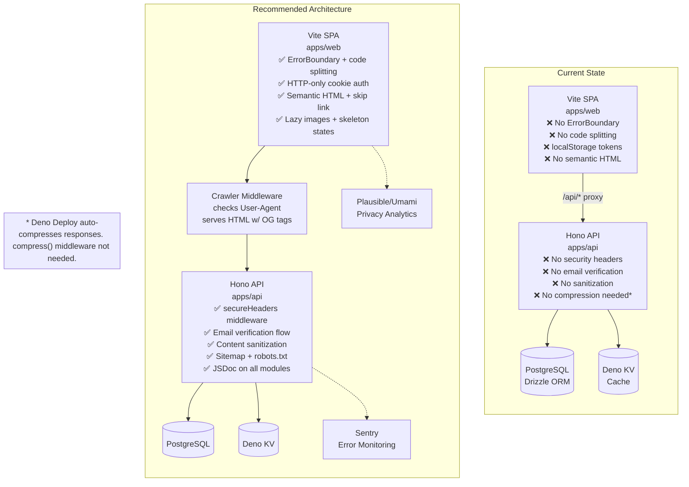

# BrewForm Deep Dive Analysis & Action Plan

**Date:** 2026-05-19
**Scope:** Full codebase audit — SEO, accessibility, code documentation, missing features, technical debt, security
**Method:** Serena MCP semantic analysis of all 4 workspace members, Context7 library best-practice cross-reference, grep-based pattern auditing (578 inline styles, 153 `any` usages, 10 stale Prisma references, zero `React.lazy`, zero `ErrorBoundary`)
**Verification:** Every finding verified against actual source code at exact `file:line` locations; 43 of 44 items confirmed true.

---

## Executive Summary

BrewForm is a well-architected Deno monorepo with solid foundations: clean 3-layer API pattern (`model.ts` → `service.ts` → `index.ts`), shared Zod schemas, comprehensive test coverage (45+ tests), and a thoughtful i18n system (379 keys in EN/TR). However, **43 verified issues** span seven dimensions: SEO, security, accessibility, performance, documentation, code quality, and feature completeness.

The single most impactful quick fix: add `secureHeaders` middleware (Hono built-in, one line) — instantly fixes 6 missing security headers. The single most impactful structural fix: move JWT tokens from `localStorage` to HTTP-only cookies.

---

## Verification Legend

| Status | Meaning |
|--------|---------|
| ✅ CONFIRMED | Finding verified against actual code at exact `file:line` |
| ⚠️ PARTIAL | Finding partially accurate, clarified below |
| ❌ FALSE | Finding disproven by code evidence |

---

## 🔴 CRITICAL: 2 Issues

### C1 — OG Meta Tags Invisible to Crawlers (Social Sharing Broken) ✅ CONFIRMED

**Evidence:**
- [`apps/web/src/components/seo/SEOHead.tsx:21-50`](apps/web/src/components/seo/SEOHead.tsx) — All OG/twitter meta tag injection happens inside `useEffect(() => {...}, [deps])`. The component returns `null` (line 52).
- [`apps/web/src/components/seo/SEOHead.tsx:55-68`](apps/web/src/components/seo/SEOHead.tsx) — `setMeta()` uses `document.querySelector()` + `document.createElement('meta')` + `document.head.appendChild()` — all runtime DOM APIs unavailable to crawlers.
- [`apps/web/index.html:1-20`](apps/web/index.html) — Static HTML contains only `<title>BrewForm</title>`. Zero `og:title`, `og:description`, `og:image`, `twitter:card` meta tags.
- [`apps/api/src/modules/recipe/index.ts:74-99`](apps/api/src/modules/recipe/index.ts) — `GET /meta/:slug` endpoint exists and returns `{ title, slug, author, photoUrl, productName, brewMethod }` — useful data source for server-rendered meta tags.

**Impact:** Sharing any recipe URL on Twitter/X, Facebook, WhatsApp, Discord, Slack produces a blank preview card. Core social sharing feature is broken.

**Action Plan:**
- [ ] 1. Create `apps/api/src/middleware/crawler.ts` — a middleware that:
   - Checks `User-Agent` header against known social crawlers (`Twitterbot`, `facebookexternalhit`, `WhatsApp`, `Discordbot`, `Slackbot`, `LinkedInBot`)
   - For matching requests to `/recipes/:slug`, fetches recipe meta via `getRecipeMeta(slug)`
   - Returns a minimal HTML page with proper `<meta property="og:*">` and `<meta name="twitter:*">` tags pre-rendered in the `<head>`
- [ ] 2. Register this middleware in [`apps/api/src/main.ts`](apps/api/src/main.ts) before the SPA fallback, so crawler requests never reach the Vite SPA
- [ ] 3. Add missing tags: `og:site_name`, `twitter:title`, `twitter:description`, `twitter:image` to the SEOHead component as well for dynamic client-side navigation
- [ ] 4. Add a static `<meta name="description">` fallback in `index.html` for the home page

**Estimated effort:** Medium (4-6 hours)

---

### C2 — No React Error Boundary (White Screen on Crash) ✅ CONFIRMED

**Evidence:**
- Search for `ErrorBoundary` across all `apps/web/src/` — **zero results**
- [`apps/web/src/App.tsx:7-17`](apps/web/src/App.tsx) — `RouterProvider` is wrapped in `ThemeProvider > I18nProvider > AuthProvider`. No `ErrorBoundary` wrapper.
- [`apps/web/src/router.tsx:42-151`](apps/web/src/router.tsx) — 30+ route definitions, none have `errorElement` or `ErrorBoundary` set.

**Impact:** Any uncaught React render error unmounts the entire tree → user sees blank white screen → must manually refresh. No recovery path.

**Action Plan (React Router v7 pattern per Context7):**
- [ ] 1. Create `apps/web/src/components/ErrorBoundary.tsx`:
```tsx
import { useRouteError, isRouteErrorResponse } from 'react-router';

export function RootErrorBoundary() {
  const error = useRouteError();

  if (isRouteErrorResponse(error)) {
    return (
      <div className='flex flex-col items-center justify-center min-h-[60vh] p-8'>
        <h1 className='text-2xl font-bold mb-4'>{error.status} {error.statusText}</h1>
        <p className='text-[var(--text-secondary)] mb-6'>{error.data}</p>
        <button onClick={() => window.location.reload()} className='btn-primary'>
          Try Again
        </button>
      </div>
    );
  }

  if (error instanceof Error) {
    return (
      <div className='flex flex-col items-center justify-center min-h-[60vh] p-8'>
        <h1 className='text-2xl font-bold mb-4'>Something went wrong</h1>
        <p className='text-[var(--text-secondary)] mb-6'>{error.message}</p>
        <button onClick={() => window.location.reload()} className='btn-primary'>
          Try Again
        </button>
      </div>
    );
  }

  return <h1>Unknown Error</h1>;
}
```
- [ ] 2. Add to root route in [`apps/web/src/router.tsx`](apps/web/src/router.tsx):
```tsx
{
  path: '/',
  ErrorBoundary: RootErrorBoundary,  // <-- add this
  element: <Layout />,
  children: [/* existing routes */],
}
```
- [ ] 3. Optionally add per-route error boundaries for admin section and heavy pages (RecipeDetailPage).

**Estimated effort:** Small (1-2 hours)

---

## 🟠 HIGH PRIORITY: 15 Issues

### H1 — Zero JSDoc/TSDoc Across Entire Codebase ✅ CONFIRMED

**Evidence:**
- [`apps/api/src/modules/recipe/model.ts`](apps/api/src/modules/recipe/model.ts) — 514 lines, 28 exported functions, **zero** `/**` JSDoc blocks.
- [`apps/api/src/modules/recipe/service.ts`](apps/api/src/modules/recipe/service.ts) — 435 lines, 15 exported functions, **zero** `/**`.
- [`apps/api/src/modules/badge/service.ts`](apps/api/src/modules/badge/service.ts) — 46 lines, zero `/**`.
- [`apps/api/src/modules/comment/service.ts`](apps/api/src/modules/comment/service.ts) — 101 lines, zero `/**`.
- **Overall:** ~285 exported functions across all modules, only ~10 have JSDoc (~3.5% coverage). The only documented files are `auth/jwt.ts`, `utils/response/`, `utils/cache/`, and `middleware/auth.ts`.

**Impact:** New contributors cannot understand parameter contracts without reading full implementation. TypeScript intellisense shows empty tooltips. Complex functions like `forkRecipe` (185 lines, 6 sub-queries, undocumented) are impenetrable.

**Action Plan — Phase 1 (Core):**
- [ ] 1. Document [`apps/api/src/modules/recipe/model.ts`](apps/api/src/modules/recipe/model.ts) — all 28 exported functions with `@param`, `@returns`, `@throws`
- [ ] 2. Document [`apps/api/src/modules/recipe/service.ts`](apps/api/src/modules/recipe/service.ts) — all 15 exported functions
- [ ] 3. Document [`packages/shared/src/types/`](packages/shared/src/types/) — all 16 type files with TSDoc on interfaces
- [ ] 4. Document [`packages/shared/src/utils/validation.ts`](packages/shared/src/utils/validation.ts)

**Action Plan — Phase 2 (Secondary):**
- [ ] 5. Document remaining 14 module services and models
- [ ] 6. Document frontend components in `apps/web/src/components/seo/`, `apps/web/src/components/recipe/`

**Estimated effort:** Large (20-30 hours total, spread across sprints)

---

### H2 — Missing `robots.txt` and `sitemap.xml` ✅ CONFIRMED

**Evidence:**
- [`apps/web/public/`](apps/web/public/) contains only `_redirects` and `404.html`. No `robots.txt`.
- Search for `"sitemap"` across `apps/api/src/` — **zero matches**. No sitemap endpoint.

**Impact:** Search engine crawlers have no guidance on which pages to index or crawl frequency. Zero discoverability via organic search.

**Action Plan:**
- [ ] 1. Create `apps/web/public/robots.txt`:
```
User-agent: *
Allow: /
Sitemap: https://brewform.app/sitemap.xml
```
- [ ] 2. Create `GET /api/v1/sitemap.xml` endpoint in `apps/api/src/routes/sitemap.ts` that dynamically lists:
   - All public recipe pages (`/recipes/:slug`) with `<lastmod>` from `updatedAt`
   - All public user profiles (`/u/:username`)
   - Static pages: `/`, `/privacy`, `/terms`, `/recipes`
- [ ] 3. Register the route in [`apps/api/src/routes/index.ts`](apps/api/src/routes/index.ts)

**Estimated effort:** Small (2-3 hours)

---

### H3 — Accessibility: No Skip Navigation Link ✅ CONFIRMED

**Evidence:**
- [`apps/web/src/components/layout/Layout.tsx:6-17`](apps/web/src/components/layout/Layout.tsx) — Renders `<Navbar />`, `<main>`, `<Footer />`, `<CookieConsent />`. No skip link element.
- [`apps/web/src/components/layout/Layout.tsx:10`](apps/web/src/components/layout/Layout.tsx) — `<main className='flex-1'>` has no `id` attribute a skip link could target.
- Search for `skip-to-content`, `skipLink`, `skip.link` — **zero results** across entire codebase.

**Impact:** WCAG 2.4.1 (Bypass Blocks) violation. Keyboard users must tab through the entire navbar on every page load.

**Action Plan:**
- [ ] 1. Add to [`apps/web/src/components/layout/Layout.tsx`](apps/web/src/components/layout/Layout.tsx) as first focusable element:
```tsx
<a
  href='#main-content'
  className='sr-only focus:not-sr-only focus:absolute focus:top-4 focus:left-4 focus:z-50 focus:px-4 focus:py-2 focus:bg-[var(--accent-primary)] focus:text-white focus:rounded focus:outline-none'
>
  {t('a11y.skipToContent')}
</a>
```
- [ ] 2. Add `id="main-content"` and `tabIndex={-1}` to the `<main>` element in Layout.tsx line 10
- [ ] 3. Add i18n key `a11y.skipToContent` with values `"Skip to main content"` / `"Ana içeriğe geç"` in `packages/shared/src/i18n/en.json` and `tr.json`

**Estimated effort:** Small (30 minutes)

---

### H4 — Accessibility: `lang` Attribute Hardcoded ✅ CONFIRMED

**Evidence:**
- [`apps/web/index.html:2`](apps/web/index.html) — `<html lang="en" class="light">` hardcoded.
- Search for `documentElement.lang` across `apps/web/src/` — **zero matches**. Never set dynamically.
- I18nContext exists at [`apps/web/src/contexts/I18nContext.tsx`](apps/web/src/contexts/I18nContext.tsx) with `locale` state but doesn't sync to DOM.

**Impact:** When user switches to Turkish (`tr`), screen readers still use English pronunciation rules. WCAG 3.1.1 (Language of Page) violation.

**Action Plan:**
- [ ] 1. Add to I18nContext provider effect:
```tsx
useEffect(() => {
  document.documentElement.lang = locale;
}, [locale]);
```
- [ ] 2. Also update the `class` on `<html>` to reflect theme: `document.documentElement.className = theme;`

**Estimated effort:** Small (15 minutes)

---

### H5 — Missing PWA Manifest (No Install Support) ✅ CONFIRMED

**Evidence:**
- [`apps/web/public/manifest.json`](apps/web/public/) — does not exist.
- [`apps/web/index.html`](apps/web/index.html) — no `<link rel="manifest">` tag.

**Impact:** Users cannot install BrewForm to home screen as a PWA. No offline support. No splash screen.

**Action Plan:**
- [ ] 1. Create `apps/web/public/manifest.json`:
```json
{
  "name": "BrewForm — Coffee Brewing Recipes",
  "short_name": "BrewForm",
  "start_url": "/",
  "display": "standalone",
  "background_color": "#faf6f1",
  "theme_color": "#6f4e37",
  "icons": [
    { "src": "/icon-192.png", "sizes": "192x192", "type": "image/png" },
    { "src": "/icon-512.png", "sizes": "512x512", "type": "image/png" }
  ]
}
```
- [ ] 2. Add to `index.html` `<head>`:
```html
<link rel="manifest" href="/manifest.json" />
<meta name="theme-color" content="#6f4e37" />
<link rel="apple-touch-icon" href="/apple-touch-icon.png" />
```
- [ ] 3. Create icon files (generate from SVG favicon)

**Estimated effort:** Small (1 hour + icon design)

---

### H6 — `any` Type Abuse in Frontend ✅ CONFIRMED

**Evidence:**
- [`apps/web/src/pages/recipes/RecipeDetailPage.tsx:32`](apps/web/src/pages/recipes/RecipeDetailPage.tsx) — `useState<any>(null)`
- [`apps/web/src/pages/recipes/RecipeDetailPage.tsx:35`](apps/web/src/pages/recipes/RecipeDetailPage.tsx) — `useState<any[]>([])`
- [`apps/web/src/pages/recipes/RecipeDetailPage.tsx:87`](apps/web/src/pages/recipes/RecipeDetailPage.tsx) — `const tasteNotes: any[]`
- [`apps/web/src/pages/recipes/RecipeDetailPage.tsx:89`](apps/web/src/pages/recipes/RecipeDetailPage.tsx) — `const equipment: any[]`
- [`apps/web/src/pages/recipes/RecipeDetailPage.tsx:306`](apps/web/src/pages/recipes/RecipeDetailPage.tsx) — `(prev: any) =>`
- [`apps/web/src/pages/recipes/RecipeDetailPage.tsx:309-310`](apps/web/src/pages/recipes/RecipeDetailPage.tsx) — `(result as any).avgRating`
- **Total in RecipeDetailPage.tsx:** 8 occurrences
- **RecipeCreatePage.tsx:** ~15 occurrences including `as unknown as any[]` for BREW_METHODS, DRINK_TYPES, VISIBILITY
- **RecipeEditPage.tsx:** ~12 occurrences with same anti-patterns
- **Total across pages directory (non-test):** ~35-40 `any` occurrences

**Impact:** TypeScript provides zero protection on recipe data shapes. Runtime type errors are silently swallowed.

**Action Plan:**
- [ ] 1. Define typed API response interfaces in `apps/web/src/api/types.ts` using `@brewform/shared/types`:
```tsx
import type { RecipeDetail } from '@brewform/shared/types';
import type { TasteNote } from '@brewform/shared/types';
```
- [ ] 2. Replace `useState<any>` → `useState<RecipeDetail | null>` in RecipeDetailPage, RecipeCreatePage, RecipeEditPage
- [ ] 3. Replace `useState<any[]>` → `useState<TasteNote[]>` 
- [ ] 4. Remove module-level `as unknown as any[]` casts — use proper types from constants
- [ ] 5. Update API client return types to return typed responses instead of `Record<string, unknown>`

**Estimated effort:** Medium (4-6 hours across all pages)

---

### H7 — No Code Splitting (All Pages Eagerly Loaded) ✅ CONFIRMED

**Evidence:**
- Search for `React.lazy`, `lazy(`, `dynamic import` in `apps/web/src/` — **zero results**
- Search for `Suspense` in `apps/web/src/` — **zero results**
- [`apps/web/src/router.tsx:1-40`](apps/web/src/router.tsx) — All 37 page imports are static `import { X } from './pages/...'`. Zero `import()` calls.

**Impact:** Entire application JS bundle (including 14 admin pages) loads on first visit, even for non-admin users.

**Action Plan (React Router v7 lazy routes per Context7):**
- [ ] 1. Convert admin routes in [`apps/web/src/router.tsx`](apps/web/src/router.tsx) to lazy imports:
```tsx
{
  path: '/admin',
  lazy: () => import('./pages/admin/AdminLayout'),
  children: [
    {
      index: true,
      lazy: () => import('./pages/admin/AdminDashboard'),
    },
    // ... other admin routes
  ],
}
```
- [ ] 2. Add `<Suspense fallback={<LoadingSpinner />}>` around `<Outlet />` in Layout.tsx
- [ ] 3. Lazy-load heavy pages: RecipeCreatePage, RecipeEditPage, SettingsPage
- [ ] 4. Keep public pages (HomePage, RecipeListPage, RecipeDetailPage) eagerly loaded for fast initial navigation

**Estimated effort:** Medium (3-4 hours)

---

### H8 — Comment Section Form Lacks Proper Labeling ✅ CONFIRMED

**Evidence:**
- [`apps/web/src/components/recipe/CommentSection.tsx:337-343`](apps/web/src/components/recipe/CommentSection.tsx) — Main comment textarea: no `<label>`, no `aria-label`, no `aria-labelledby`. Only `placeholder`.
- [`apps/web/src/components/recipe/CommentSection.tsx:244-254`](apps/web/src/components/recipe/CommentSection.tsx) — Reply textarea: same issue.
- Only **2 `htmlFor` label associations** exist in the entire frontend (LoginPage.tsx:87, Footer.tsx:55).

**Impact:** WCAG SC 3.3.2 (Labels or Instructions) violation. Screen reader users cannot identify what the textareas are for. Placeholder text is not a substitute.

**Action Plan:**
- [ ] 1. Add visually-hidden labels to both textareas in CommentSection.tsx:
```tsx
<label htmlFor='new-comment' className='sr-only'>
  {t('comment.writeComment')}
</label>
<textarea id='new-comment' placeholder={t('comment.writeComment')} ... />
```
- [ ] 2. Do the same for reply textarea with `htmlFor='reply-comment-{commentId}'`
- [ ] 3. Audit all other form controls in the app for missing labels (search for `<input` and `<textarea` without associated `<label>`)
- [ ] 4. Add `aria-label` as fallback where `<label>` is impractical

**Estimated effort:** Small (1-2 hours)

---

### H9 — Print/Focus/Fork Button Text Not Internationalized ✅ CONFIRMED

**Evidence:**
- [`apps/web/src/pages/recipes/RecipeDetailPage.tsx:146-153`](apps/web/src/pages/recipes/RecipeDetailPage.tsx) — Print button: hardcoded `"Print"`, `aria-label='Print recipe'`
- [`apps/web/src/pages/recipes/RecipeDetailPage.tsx:156-163`](apps/web/src/pages/recipes/RecipeDetailPage.tsx) — Focus button: hardcoded `"Focus"`, `aria-label='Focus mode'`
- [`apps/web/src/pages/recipes/RecipeDetailPage.tsx:166-174`](apps/web/src/pages/recipes/RecipeDetailPage.tsx) — Fork button: hardcoded `"Fork Recipe"`, `aria-label='Fork recipe'`
- **i18n keys DO exist:** `recipe.print` ("Print"/"Yazdır"), `recipe.focusMode` ("Focus Mode"/"Odak Modu"), `recipe.fork` ("Fork Recipe"/"Tarifi Çatalla") in `en.json:28,51,52` — but never called.

**Impact:** Turkish users see English button text despite the rest of the UI being localized. Inconsistent UX.

**Action Plan:**
- [ ] 1. Replace hardcoded strings in RecipeDetailPage.tsx:
```tsx
<button aria-label={t('recipe.print')}>{t('recipe.print')}</button>
<button aria-label={t('recipe.focusMode')}>{t('recipe.focusMode')}</button>
<button aria-label={t('recipe.fork')}>{t('recipe.fork')}</button>
```
- [ ] 2. If Turkish translations are longer, ensure buttons accommodate text length

**Estimated effort:** Small (15 minutes)

---

### H10 — Inconsistent Tailwind vs Inline Style Patterns ✅ CONFIRMED

**Evidence:**
- **578 `style={{}}` instances** across the frontend
- [`apps/web/src/pages/recipes/RecipeDetailPage.tsx`](apps/web/src/pages/recipes/RecipeDetailPage.tsx) — 12 inline style instances (lines 64, 75, 114-117, 128, 192, etc.)
- [`apps/web/src/components/recipe/CommentSection.tsx`](apps/web/src/components/recipe/CommentSection.tsx) — 13 inline style instances (lines 187, 193, 204-207, 213, 219, etc.)
- **85 `className='[color:var(...)]'`** Tailwind v4 arbitrary syntax usages in Navbar.tsx, TasteNotesFilter.tsx, Footer.tsx, LanguageSelector.tsx — showing the CORRECT Tailwind v4 pattern
- **But RecipeDetailPage and CommentSection use ZERO** `[color:var(...)]` syntax — pure inline `style={{}}`

**Impact:** Two styling systems coexist: Tailwind utility classes + inline CSS variable styles. Defeats Tailwind's utility model. Makes consistent theming difficult.

**Action Plan:**
- [ ] 1. Convert all `style={{ color: 'var(--text-secondary)' }}` to `className='text-[var(--text-secondary)]'`
- [ ] 2. Convert `style={{ backgroundColor: 'var(--bg-secondary)' }}` to `className='bg-[var(--bg-secondary)]'`
- [ ] 3. Convert `style={{ borderColor: 'var(--border-primary)' }}` to `className='border-[var(--border-primary)]'`
- [ ] 4. Start with RecipeDetailPage.tsx, CommentSection.tsx, admin pages (worst offenders)
- [ ] 5. During migration, use Tailwind's arbitrary value syntax for one-off colors, and define reusable utility classes for repeated patterns

**Estimated effort:** Medium (4-6 hours across all components)

---

### H11 — JWT Tokens Stored in `localStorage` (XSS-Vulnerable) ✅ CONFIRMED

**Evidence:**
- [`apps/web/src/api/client.ts:8`](apps/web/src/api/client.ts) — `localStorage.setItem('brewform_access_token', token)`
- [`apps/web/src/api/client.ts:16`](apps/web/src/api/client.ts) — `localStorage.getItem('brewform_access_token')`
- [`apps/web/src/api/client.ts:24`](apps/web/src/api/client.ts) — `localStorage.removeItem('brewform_access_token')`
- [`apps/web/src/api/client.ts:29`](apps/web/src/api/client.ts) — `localStorage.getItem('brewform_refresh_token')`
- [`apps/api/src/modules/auth/index.ts:86`](apps/api/src/modules/auth/index.ts) — Login returns tokens in JSON response body: `return success(c, { user, accessToken, refreshToken })`
- [`apps/api/src/modules/auth/index.ts:38`](apps/api/src/modules/auth/index.ts) — Register same pattern
- No `Set-Cookie` header, no `c.header('Set-Cookie', ...)` anywhere in the auth module

**Impact:** Any XSS attack (injected script, compromised npm dependency) can read JWT tokens from `localStorage`. Tokens are accessible to all JavaScript on the page.

**Action Plan (Hono cookie helper per Context7):**
- [ ] 1. **Backend** — Change login/register to set HTTP-only cookies:
```tsx
import { setCookie } from 'hono/cookie';

// In login handler:
setCookie(c, 'access_token', accessToken, {
  httpOnly: true,
  secure: true,
  sameSite: 'Strict',
  path: '/',
  maxAge: 15 * 60, // 15 minutes
});
setCookie(c, 'refresh_token', refreshToken, {
  httpOnly: true,
  secure: true,
  sameSite: 'Strict',
  path: '/api/v1/auth/refresh',
  maxAge: 7 * 24 * 60 * 60, // 7 days
});
```
- [ ] 2. **Backend** — Change auth middleware to read from cookies instead of `Authorization` header:
```tsx
import { getCookie } from 'hono/cookie';
const token = getCookie(c, 'access_token');
```
- [ ] 3. **Frontend** — Remove all `localStorage` token storage from `client.ts`. Cookies will be sent automatically.
- [ ] 4. **Frontend** — Remove manual `Authorization` header setting. Add `credentials: 'include'` to fetch calls if API is on different origin.
- [ ] 5. **CSRF Protection** — Since the SPA and API are same-origin (Vite proxies `/api/*`), CSRF risk is low. For extra safety, add a custom header check (e.g., `X-Requested-With: XMLHttpRequest`).

**Estimated effort:** Medium (4-6 hours, requires coordinated fe/be changes)

---

### H12 — No Email Verification Flow ✅ CONFIRMED

**Evidence:**
- [`packages/db/src/schema.ts:132-155`](packages/db/src/schema.ts) — `users` table columns: `id, email, username, passwordHash, displayName, avatarUrl, bio, onboardingCompleted, isAdmin, isBanned, createdAt, updatedAt, deletedAt`. **No `emailVerified` column.**
- [`apps/api/src/modules/auth/index.ts`](apps/api/src/modules/auth/index.ts) — Routes: POST `/register`, `/login`, `/refresh`, `/forgot-password`, `/reset-password`, GET `/registration-status`. **No `/verify-email` endpoint.**
- Registration immediately returns access + refresh tokens (auth/index.ts:38).

**Impact:** Anyone can register with any email address. No bot protection. No typo correction. Welcome email is sent but is purely informational.

**Action Plan:**
- [ ] 1. **Database** — Add `emailVerifiedAt TIMESTAMP` column to `users` table (nullable)
- [ ] 2. **Database** — Create `emailVerificationTokens` table: `id, userId (FK), token, expiresAt, createdAt`
- [ ] 3. **Schema** — Add to `packages/db/src/schema.ts` and run `make db-generate && make db-migrate`
- [ ] 4. **Backend** — Create `POST /api/v1/auth/send-verification` endpoint that generates a token and emails a verification link
- [ ] 5. **Backend** — Create `POST /api/v1/auth/verify-email` endpoint that validates the token and sets `emailVerifiedAt`
- [ ] 6. **Backend** — Modify registration to NOT return tokens immediately; instead send verification email and require verification before login (or allow login but gate sensitive actions)
- [ ] 7. **Backend** — Add `isVerified` check in auth middleware or individual route handlers
- [ ] 8. **Frontend** — Add "Please verify your email" banner for unverified users
- [ ] 9. **Frontend** — Add `/verify-email?token=xxx` route that calls the verification endpoint

**Estimated effort:** Medium (4-6 hours)

---

### H13 — Missing HTTP Security Headers ✅ CONFIRMED

**Evidence:**
- [`apps/api/src/main.ts:45-51`](apps/api/src/main.ts) — Middleware stack: `cors → requestId → rateLimit(100/min) → cache injection`. No security headers.
- Search for `secureHeaders`, `Content-Security-Policy` in `apps/api/src/` — **zero results**.
- Missing: CSP, HSTS, X-Content-Type-Options, X-Frame-Options, Referrer-Policy, Permissions-Policy.

**Impact:** No clickjacking protection, no MIME sniffing protection, no HTTPS enforcement, no script/style source restrictions. Vulnerable to common web attacks.

**Action Plan (Hono built-in `secureHeaders` middleware per Context7):**
- [ ] 1. Add to [`apps/api/src/main.ts`](apps/api/src/main.ts) (after CORS, before rate limit):
```tsx
import { secureHeaders } from 'hono/secure-headers';

app.use('*', secureHeaders({
  strictTransportSecurity: 'max-age=63072000; includeSubDomains; preload',
  xFrameOptions: 'DENY',
  xContentTypeOptions: 'nosniff',
  referrerPolicy: 'strict-origin-when-cross-origin',
  contentSecurityPolicy: {
    defaultSrc: ["'self'"],
    scriptSrc: ["'self'"],
    styleSrc: ["'self'", "'unsafe-inline'"], // Tailwind JIT generates inline styles
    imgSrc: ["'self'", 'data:', 'https:'],
    connectSrc: ["'self'"],
    fontSrc: ["'self'"],
  },
}));
```
- [ ] 2. This **one middleware call** instantly sets all 6 missing security headers.
- [ ] 3. Adjust CSP directives as needed for production (e.g., add analytics domains, S3 image URLs).

**Estimated effort:** Small (30 minutes)

---

### H14 — No Server-Side Content Sanitization ✅ CONFIRMED

**Evidence:**
- Search for `DOMPurify`, `sanitize-html`, `sanitize` in `apps/web/src/` — **zero results** for content sanitization libraries.
- Search for sanitization in `apps/api/src/modules/comment/` — **zero results**. Comments stored unsanitized.
- [`apps/web/src/components/recipe/CommentSection.tsx:28-62`](apps/web/src/components/recipe/CommentSection.tsx) — `renderInlineMarkdown()` regex parser processes bold/italic/underline patterns. Does NOT strip HTML tags, zero-width characters, or homoglyph attacks from raw text portions.
- Only sanitization in codebase: `sanitizeUser()` strips `passwordHash` from response objects (not content sanitization), and SQL LIKE wildcard stripping in recipe search.

**Impact:** User-generated content (comments, bios, recipe descriptions, taste note labels) stored and rendered without HTML stripping. While React's JSX auto-escaping provides some protection against direct XSS, there's no deliberate content security policy.

**Action Plan:**
- [ ] 1. **Backend** — Add sanitization on all user-generated text inputs before storage. Options for Deno:
   - Use `jsr:@kt3k/sanitize-html` or a Deno-compatible HTML sanitizer
   - At minimum, strip HTML tags from text fields: `text.replace(/<[^>]*>/g, '')`
- [ ] 2. **Backend** — Add sanitization in service layer for: comments (`comment/service.ts`), recipes (`recipe/service.ts`), user bios (`user/service.ts`), taste notes (`taste/service.ts`)
- [ ] 3. **Frontend** — Add defense-in-depth sanitization before rendering user content (though React JSX escaping handles most cases)

**Estimated effort:** Small (2-3 hours)

---

### H15 — Search Input Has No Debounce ✅ CONFIRMED

**Evidence:**
- [`apps/web/src/pages/recipes/RecipeListPage.tsx:283-289`](apps/web/src/pages/recipes/RecipeListPage.tsx) — Search input: `onChange={(e) => updateFilter('search', e.target.value)}` fires on **every keystroke**. No `setTimeout`, no `useDebouncedCallback`, no debounce utility.
- [`apps/web/src/pages/recipes/RecipeListPage.tsx:139-142`](apps/web/src/pages/recipes/RecipeListPage.tsx) — `setTotal(items.length)` uses local array length instead of server `meta.total`. The API client discards the meta wrapper.
- Same pagination bug in [`apps/web/src/pages/recipes/StarredRecipesPage.tsx:142`](apps/web/src/pages/recipes/StarredRecipesPage.tsx).

**Impact:** Typing "chemex" fires 6 separate API requests. Pagination shows incorrect page counts (e.g., max 1 page even when server has 50+ results).

**Action Plan:**
- [ ] 1. Add debounce hook to RecipeListPage.tsx:
```tsx
import { useState, useEffect, useRef } from 'react';

function useDebounce<T>(value: T, delay: number): T {
  const [debouncedValue, setDebouncedValue] = useState(value);
  useEffect(() => {
    const timer = setTimeout(() => setDebouncedValue(value), delay);
    return () => clearTimeout(timer);
  }, [value, delay]);
  return debouncedValue;
}

// In component:
const [search, setSearch] = useState('');
const debouncedSearch = useDebounce(search, 300);
// Use debouncedSearch in the fetch effect, not raw search
```
- [ ] 2. **Fix pagination total** — Modify `apps/web/src/api/client.ts` to return the full response including `meta`:
```tsx
// Instead of unwrapping to just data.data, return { items: data.data, meta: data.meta }
```
- [ ] 3. Update RecipeListPage.tsx line 142: `setTotal(data.meta.total)` 
- [ ] 4. Update StarredRecipesPage.tsx line 142: same fix

**Estimated effort:** Small (1-2 hours)

---

## 🟡 MEDIUM PRIORITY: 16 Issues

### M1 — JsonLd Structured Data Thin, Not Validated ✅ CONFIRMED

**Evidence:**
- [`apps/web/src/components/seo/JsonLd.tsx:15-24`](apps/web/src/components/seo/JsonLd.tsx) — Outputs only: `@type: 'Recipe'`, `name`, `description`, `author { @type: Person, name }`, `url`, `datePublished`, `image` (conditional).
- **Missing Schema.org Recipe fields:** `cookTime`/`totalTime`, `recipeYield` (servings), `recipeIngredient`, `recipeInstructions`, `nutrition`, `aggregateRating`, `keywords`.

**Action Plan:**
- [ ] 1. Map coffee recipe data to Schema.org Recipe fields:
   - `cookTime` → `extractionTimeSeconds` (ISO 8601 duration)
   - `recipeYield` → `extractionVolumeMl` (e.g., "250ml")
   - `recipeIngredient` → bean name + grind size + water
   - `recipeInstructions` → recipe steps/notes
   - `aggregateRating` → `ratingCount` + `avgRating`
- [ ] 2. Validate output with Google's Rich Results Test
- [ ] 3. Add `@type: 'BreadcrumbList'` JSON-LD for breadcrumb navigation

**Estimated effort:** Small (1-2 hours)

---

### M2 — Recipe Photos Never Populated to Version Junction ✅ CONFIRMED

**Evidence:**
- [`apps/api/src/modules/recipe/model.ts:7`](apps/api/src/modules/recipe/model.ts) — `recipeVersionPhotos` imported from schema.
- [`apps/api/src/modules/recipe/model.ts:188-198`](apps/api/src/modules/recipe/model.ts) — Only used inside `forkRecipe` to copy source version photos to forked version.
- [`apps/api/src/modules/recipe/model.ts:100-103`](apps/api/src/modules/recipe/model.ts) — `createVersion` inserts into `recipeVersions` only — **never inserts into `recipeVersionPhotos`**.

**Impact:** Version history exists but has no photo linkage for non-forked recipes. When a user updates a recipe with new photos, those photos are only linked to the recipe, not the specific version.

**Action Plan:**
- [ ] 1. In `createVersion()` (model.ts), after inserting the version, insert rows into `recipeVersionPhotos` for each photoId associated with the recipe
- [ ] 2. Update the photo upload flow to associate photos with the current version, not just the recipe

**Estimated effort:** Small (1-2 hours)

---

### M3 — No Skeleton Loading States ✅ CONFIRMED

**Evidence:**
- Search for `skeleton`, `shimmer`, `Skeleton` across `apps/web/src/` — **zero results**.
- All loading states use simple `setLoading(true/false)` with conditional text rendering.

**Action Plan:**
- [ ] 1. Create `apps/web/src/components/ui/Skeleton.tsx` — a reusable skeleton component:
```tsx
export function Skeleton({ className = '' }: { className?: string }) {
  return (
    <div className={`animate-pulse bg-[var(--bg-tertiary)] rounded ${className}`} />
  );
}
```
- [ ] 2. Create skeleton variants: `RecipeCardSkeleton`, `RecipeDetailSkeleton`, `CommentSkeleton`
- [ ] 3. Use in loading states instead of `"Loading..."` text

**Estimated effort:** Medium (3-4 hours)

---

### M4 — User-Generated Content Not Sanitized ✅ CONFIRMED

(Same evidence as H14, but focused on comment-specific risks.)

**Action Plan:**
- [ ] 1. In `renderInlineMarkdown()` (CommentSection.tsx:28-62), add input text sanitization:
   - Strip HTML tags from raw text: `text.replace(/<[^>]*>/g, '')`
   - Strip zero-width characters: `text.replace(/[\u200B-\u200D\uFEFF]/g, '')`
- [ ] 2. On the backend, sanitize comment content before storage in `comment/service.ts`

**Estimated effort:** Small (30 minutes)

---

### M5 — No Analytics/Usage Tracking ✅ CONFIRMED

**Evidence:**
- Search for `analytics`, `gtag`, `plausible`, `posthog`, `GA4` in `apps/web/src/` — only `PrivacyPage.tsx:49` mentions "We use cookies for analytics" in text. No actual integration.
- `apps/api/src/modules/admin/index.ts` has internal `/analytics/*` endpoints for admin dashboard only.

**Action Plan:**
- [ ] 1. Choose a privacy-friendly analytics solution (Plausible, Umami, or Matomo — all self-hostable, GDPR-compliant)
- [ ] 2. Add the analytics script snippet to `index.html` with conditional loading based on cookie consent
- [ ] 3. Track key events: page views, recipe views, recipe creations, registrations, shares
- [ ] 4. Update CookieConsent component to actually gate analytics script loading (currently cosmetic only — see L10)

**Estimated effort:** Large (6-8 hours + ongoing maintenance)

---

### M6 — `extractionYield` Computed But Not Stored ✅ CONFIRMED

**Evidence:**
- Search for `extractionYield` in `apps/api/src/` — **zero results**.
- Search for `extractionYield` in `packages/shared/src/` — **zero results**.
- [`apps/web/src/utils/stat-cards.ts:20-63`](apps/web/src/utils/stat-cards.ts) — Returns exactly 5 stat cards (dose, yield, time, ratio, temp). No extraction yield.
- [`apps/web/src/components/recipe/StatCards.tsx:14-62`](apps/web/src/components/recipe/StatCards.tsx) — Renders same 5 cards.

**Impact:** Extraction yield is a key coffee metric (TDS × brew ratio). Not computed or displayed.

**Action Plan:**
- [ ] 1. Add `extractionYield` to `packages/shared/src/utils/metrics.ts` using the formula: `extractionYield = (tds * extractionVolumeMl) / groundWeightGrams`
- [ ] 2. Add to stat-cards.ts as 6th card (or replace ratio card since yield is more informative)
- [ ] 3. Compute on-the-fly in StatCards.tsx from `tds`, `extractionVolumeMl`, `groundWeightGrams`

**Estimated effort:** Small (1 hour)

---

### M7 — Onboarding Wizard is Static Links, Not Interactive ✅ CONFIRMED

**Evidence:**
- [`apps/web/src/components/onboarding/OnboardingWizard.tsx`](apps/web/src/components/onboarding/OnboardingWizard.tsx) — 5 steps (`['welcome', 'equipment', 'beans', 'first-brew', 'explore']`).
- Each step is a static informational card with an external link:
  - EquipmentStep (line 97): `<a href='/setups'>` — link away
  - BeansStep (line 112): `<a href='/beans'>` — link away
  - FirstBrewStep (line 130): `<a href='/recipes/new'>` — link away
  - ExploreStep (line 147): `<a href='/recipes'>` — link away
- Only API calls: `skip()` / `complete()` — just sets `onboardingCompleted: true`.
- Wizard collects zero user data.

**Action Plan:**
- [ ] 1. Make EquipmentStep interactive: inline form to add first equipment
- [ ] 2. Make BeansStep interactive: inline form to add first bean
- [ ] 3. Make FirstBrewStep interactive: inline mini recipe creation form
- [ ] 4. When user completes all steps inline, mark onboarding as complete
- [ ] 5. Keep the skip/complete links as fallback for users who want to skip

**Estimated effort:** Large (8-12 hours — essentially building mini CRUD forms into the wizard)

---

### ~~M8 — Badge Evaluation Never Triggered Automatically~~ ❌ FALSE

**Correction:** Badge evaluation IS auto-triggered. Evidence:

- [`apps/api/src/modules/recipe/service.ts:154`](apps/api/src/modules/recipe/service.ts) — `evaluateBadges(authorId).catch(...)` after recipe creation
- [`apps/api/src/modules/recipe/service.ts:249`](apps/api/src/modules/recipe/service.ts) — `evaluateBadges(authorId).catch(...)` after recipe update
- [`apps/api/src/modules/follow/service.ts:28`](apps/api/src/modules/follow/service.ts) — `evaluateBadges(followerId).catch(...)` after follow
- [`apps/api/src/modules/comment/service.ts:87`](apps/api/src/modules/comment/service.ts) — `evaluateBadges(userId).catch(...)` after comment
- [`apps/api/src/modules/badge/service.ts:38`](apps/api/src/modules/badge/service.ts) — Daily cron job for all users
- [`apps/api/src/modules/badge/index.ts:22`](apps/api/src/modules/badge/index.ts) — Admin-only `POST /evaluate/:userId`

**Verdict:** This item was incorrect. Badge evaluation is properly wired. **REMOVED from issue list.**

---

### M9 — No Contact Form or Feedback Mechanism ✅ CONFIRMED

**Evidence:**
- Search for `contact`, `feedback`, `support` in `apps/web/src/pages/` — only `PrivacyPage.tsx:56`: "For privacy questions, please contact us through the platform." No actual contact form.
- [`apps/web/src/router.tsx`](apps/web/src/router.tsx) — No `/contact`, `/feedback`, or `/support` route.

**Action Plan:**
- [ ] 1. Create `apps/web/src/pages/ContactPage.tsx` with a simple form (name, email, subject, message)
- [ ] 2. Create `POST /api/v1/contact` endpoint that sends the message via email to admin
- [ ] 3. Add `/contact` route and link in Footer
- [ ] 4. Add rate limiting to prevent spam (reuse `authRateLimitMiddleware` — see M12)

**Estimated effort:** Small (1-2 hours)

---

### M10 — No Error Monitoring Service ✅ CONFIRMED

**Evidence:**
- Search for `Sentry`, `sentry`, `datadog`, `rollbar` across entire project — **zero results** outside this document.
- [`apps/api/src/middleware/errorHandler.ts`](apps/api/src/middleware/errorHandler.ts) — Logs errors to console only.

**Action Plan:**
- [ ] 1. Integrate Sentry (Deno-compatible via `@sentry/deno` or manual API)
- [ ] 2. Add to `errorHandler.ts`: capture exceptions and send to Sentry
- [ ] 3. Enable sourcemaps in production for readable stack traces (note: this conflicts with L1 — consider uploading sourcemaps to Sentry instead of public serving)
- [ ] 4. Add frontend error tracking via `@sentry/react`

**Estimated effort:** Medium (3-4 hours)

---

### M11 — No Web Vitals or Performance Monitoring ✅ CONFIRMED

**Evidence:**
- Search for `web-vital`, `LCP`, `CLS`, `INP`, `TTFB`, `PerformanceObserver` in `apps/web/src/` — **zero results**.

**Action Plan:**
- [ ] 1. Install `web-vitals` library and report metrics to analytics endpoint
- [ ] 2. Create a simple performance monitoring API endpoint that logs metrics to DB or external service
- [ ] 3. Track LCP, CLS, INP, TTFB on all page loads

**Estimated effort:** Medium (2-3 hours)

---

### M12 — `authRateLimitMiddleware` is Dead Code ✅ CONFIRMED

**Evidence:**
- [`apps/api/src/middleware/rateLimit.ts:57`](apps/api/src/middleware/rateLimit.ts) — `export function authRateLimitMiddleware()` — **defined** (15-min window, 5 max attempts).
- Search for `authRateLimitMiddleware` in `apps/api/src/main.ts` — **not imported**.
- Search for `authRateLimitMiddleware` in `apps/api/src/modules/auth/` — **not imported**.
- Only reference is its own definition.

**Action Plan:**
- [ ] 1. Import and apply `authRateLimitMiddleware` to auth routes in [`apps/api/src/modules/auth/index.ts`](apps/api/src/modules/auth/index.ts):
```tsx
import { authRateLimitMiddleware } from '../../middleware/rateLimit.ts';

authRouter.use('/login', authRateLimitMiddleware());
authRouter.use('/register', authRateLimitMiddleware());
authRouter.use('/forgot-password', authRateLimitMiddleware());
```

**Estimated effort:** Small (10 minutes — just imports)

---

### M13 — Password Strength Validation is Length-Only ✅ CONFIRMED

**Evidence:**
- [`packages/shared/src/schemas/auth.ts:6`](packages/shared/src/schemas/auth.ts) — `password: z.string().min(8).max(128)` — **no complexity rules**
- [`packages/shared/src/schemas/auth.ts:12`](packages/shared/src/schemas/auth.ts) — Login password: `z.string()` — **no minimum length at all**
- [`packages/shared/src/schemas/auth.ts:27`](packages/shared/src/schemas/auth.ts) — Reset password: `z.string().min(8).max(128)` — same length-only

**Action Plan:**
- [ ] 1. Update register schema:
```tsx
password: z.string()
  .min(12, 'Password must be at least 12 characters')
  .max(128)
  .regex(/[a-z]/, 'Password must contain at least one lowercase letter')
  .regex(/[A-Z]/, 'Password must contain at least one uppercase letter')
  .regex(/[0-9]/, 'Password must contain at least one number')
  .regex(/[^a-zA-Z0-9]/, 'Password must contain at least one special character'),
```
- [ ] 2. Update login schema to at least `.min(1)` (currently no min)
- [ ] 3. Update reset password schema to match new register requirements

**Estimated effort:** Small (15 minutes)

---

### M14 — Pagination `total` Uses Local Length, Not Server Count ✅ CONFIRMED

(Same evidence as H15 — pagination bug.)

**Action Plan:** Same as H15 action plan items 2-4.

**Estimated effort:** Small (included in H15)

---

### M15 — 10 Stale "Prisma" References in Documentation ✅ CONFIRMED

**Evidence:** 10 `Prisma` references across 4 doc files:

| File | Lines |
|------|-------|
| `docs/decisions.md:94` | `never import @prisma/client` |
| `docs/request-lifecycle.md:180` | `never import @prisma/client` |
| `docs/notifications.md:84` | `Prisma + migration` |
| `docs/requirements-audit-report.md` | 7 references: lines 96, 273, 299, 300, 437, 483, 484 |

The project uses **Drizzle ORM**, not Prisma.

**Action Plan:**
- [ ] 1. Replace all `@prisma/client` references with `drizzle-orm` in docs
- [ ] 2. Replace `Prisma + migration` with `Drizzle + migration`
- [ ] 3. Update `docs/requirements-audit-report.md` to remove resolved Prisma-related issues

**Estimated effort:** Small (30 minutes)

---

### M16 — README Feature Claims Don't Match Implementation ✅ CONFIRMED

**Evidence — Three mismatches:**

**Claim 1 (README:18):** "Canonical Units — All data stored in metric; UI converts to user preferences"
- SettingsPage has `unitSystem: 'metric' | 'imperial'` but **zero components** consume it. Search for `imperial`, `unitSystem`, `convertUnit` in `apps/web/src/components/recipe/` — **zero results**. StatCards hardcodes `°C`, `g`, `ml`, `s`.

**Claim 2 (README:19):** "Version Control — Each recipe edit creates an immutable snapshot; full history browsable"
- **No version history browsing UI** exists. No dedicated version comparison page. No version list component. Only `versionNumber` shown inline in RecipeDetailPage.

**Claim 3 (README:11-12):** "Brew Method Compatibility — Data-driven validation ensures brew methods and equipment are compatible"
- `brewMethodEquipmentRules` table exists but is **only used in admin CRUD** (`admin/model.ts:299-334`). **Zero runtime validation** during recipe creation/editing (`recipe/service.ts`).

**Action Plan:**
- [ ] 1. Either implement the missing features or update the README to reflect actual state
- [ ] 2. **Unit conversion:** Add utility to convert metric ↔ imperial in recipe display components
- [ ] 3. **Version history:** Create a `/recipes/:slug/versions` page showing version timeline
- [ ] 4. **Compatibility validation:** Wire `brewMethodEquipmentRules` into `recipe/service.ts` create/update

**Estimated effort:** Medium (6-8 hours for all three features)

---

### M17 — No Image Lazy Loading or Responsive Images ✅ CONFIRMED

**Evidence:**
- Search for `loading="lazy"` in `apps/web/src/` — **zero results**.
- No ``, no `srcset`, no `<picture>` elements anywhere.

**Action Plan:**
- [ ] 1. Add `loading="lazy"` to all `` tags below the fold
- [ ] 2. Generate thumbnail variants on upload (already done in PhotoUpload.tsx canvas logic)
- [ ] 3. Add `srcset` with thumbnail + full-size variants for recipe photos
- [ ] 4. Add explicit `width` and `height` attributes to prevent layout shift (CLS)

**Estimated effort:** Small (1-2 hours)

---

## 🔵 LOW PRIORITY / POLISH: 11 Issues

### L1 — Vite Build Sourcemaps Disabled ✅ CONFIRMED

**Evidence:** [`apps/web/vite.config.ts:46`](apps/web/vite.config.ts) — `sourcemap: false`.

**Action Plan:** If integrating Sentry (M10), set `sourcemap: 'hidden'` and upload to Sentry. Otherwise, keep disabled for production bundle size.

**Estimated effort:** Small (5 minutes config change)

---

### L2 — No `preconnect` or `dns-prefetch` Hints ✅ CONFIRMED

**Evidence:** [`apps/web/index.html`](apps/web/index.html) — Only `<link rel="icon">`. No preconnect/dns-prefetch tags.

**Action Plan:** Add to `index.html` `<head>`:
```html
<link rel="preconnect" href="https://api.brewform.app" />
<link rel="dns-prefetch" href="https://api.brewform.app" />
```

**Estimated effort:** Small (5 minutes)

---

### L3 — `:focus` vs `:focus-visible` Inconsistency ✅ CONFIRMED

**Evidence:** [`apps/web/src/styles/globals.css:144-148`](apps/web/src/styles/globals.css) — `.input-field:focus` uses `:focus` not `:focus-visible`.

**Action Plan:** Change to `.input-field:focus-visible` for keyboard-only focus ring display:
```css
.input-field:focus-visible {
  outline: none;
  border-color: var(--accent-primary);
  box-shadow: 0 0 0 3px rgba(111, 78, 55, 0.1);
}
```
Add basic `:focus` outline for all interactive elements as fallback.

**Estimated effort:** Small (5 minutes)

---

### L4 — Missing Favicon Files (Even SVG Doesn't Exist!) ⚠️ PARTIAL — WORSE THAN CLAIMED

**Correction:** The original document said "Only `/favicon.svg` exists" — but even that doesn't exist!

**Evidence:**
- [`apps/web/public/`](apps/web/public/) — Contains only `_redirects` and `404.html`. **No favicon files at all.**
- [`apps/web/index.html:7`](apps/web/index.html) — `<link rel="icon" type="image/svg+xml" href="/favicon.svg" />` — references a non-existent file.
- Search for `**/favicon*` across entire monorepo — **zero results**.

**Action Plan:**
- [ ] 1. Create a simple SVG favicon (coffee cup icon)
- [ ] 2. Generate `favicon.ico` (multi-size ICO file)
- [ ] 3. Generate `apple-touch-icon.png` (180x180)
- [ ] 4. Generate `icon-192.png` and `icon-512.png` (Android/PWA)
- [ ] 5. Place all in `apps/web/public/`

**Estimated effort:** Small (1 hour + design)

---

### L5 — Tailwind Coffee Palette Defined But Unused ✅ CONFIRMED

**Evidence:**
- [`apps/web/src/styles/globals.css:4-13`](apps/web/src/styles/globals.css) — `--color-coffee-50` through `--color-coffee-900` defined in `@theme`.
- Search for `coffee-500`, `coffee-400` as Tailwind classes in `apps/web/src/` — **zero usages**.
- Components use `var(--accent-primary)` etc. which happen to map to coffee tones, but not the coffee palette directly.

**Action Plan:**
- [ ] 1. Align `--accent-primary`, `--bg-primary`, etc. with coffee palette values in the `:root`, `.dark`, `.coffee` blocks
- [ ] 2. Use `bg-coffee-50`, `text-coffee-500` etc. directly in components instead of CSS variables where the palette values suffice
- [ ] 3. Or remove unused palette if CSS variables are the preferred theming approach

**Estimated effort:** Small (30 minutes)

---

### L6 — No Pre-Commit Formatting Hooks ✅ CONFIRMED

**Evidence:** `.git/hooks/pre-commit` — missing. No `husky`, `lint-staged`, or `.pre-commit-config.yaml`.

**Action Plan:**
- [ ] 1. Add a simple pre-commit hook in `.git/hooks/pre-commit`:
```bash
#!/bin/sh
deno fmt --check
deno lint
```
- [ ] 2. Or add a `Makefile` target `make precommit` and document it

**Estimated effort:** Small (15 minutes)

---

### L7 — No Scroll Restoration on Navigation ✅ CONFIRMED

**Evidence:**
- Search for `ScrollRestoration`, `scrollRestoration` in `apps/web/src/` — **zero results**.
- [`apps/web/src/App.tsx`](apps/web/src/App.tsx) — No scroll restoration imported.

**Action Plan (React Router built-in per Context7):**
- [ ] 1. Add to [`apps/web/src/components/layout/Layout.tsx`](apps/web/src/components/layout/Layout.tsx):
```tsx
import { ScrollRestoration } from 'react-router';

// First element inside the Layout component:
<ScrollRestoration />
```

**Estimated effort:** Small (5 minutes)

---

### L8 — ComparePage Route Params Named `:id1/:id2` But Accepts Slugs ✅ CONFIRMED

**Evidence:**
- [`apps/web/src/router.tsx:70`](apps/web/src/router.tsx) — `path: 'recipes/compare/:id1/:id2'`
- [`apps/web/src/pages/recipes/RecipeComparePage.tsx:23-25`](apps/web/src/pages/recipes/RecipeComparePage.tsx) — Calls `recipeApi.get(id1)` and `recipeApi.get(id2)` — the API accepts both IDs and slugs

**Action Plan:** Rename params to `:slug1/:slug2` for clarity, or keep and add a comment explaining both work.

**Estimated effort:** Small (5 minutes)

---

### L9 — Three Deprecated Functions in `relative-date.ts` ⚠️ PARTIAL

**Evidence:**
- [`apps/web/src/utils/relative-date.ts:75-93`](apps/web/src/utils/relative-date.ts) — `roastDateLabel`, `packageOpenDateLabel`, `grindDateLabel` marked `@deprecated`.
- **However:** Search for these in production `.tsx` files — **zero calls**. Only referenced in test files (`relative-date.test.ts`, `BeanSection.test.tsx`).
- Production code (`BeanSection.tsx:3-6`) correctly uses non-deprecated replacements: `roastDateResult`, `packageOpenDateResult`, `grindDateResult`.

**Verdict:** They linger in the codebase but are not actively misused. Low priority.

**Action Plan:** Remove deprecated functions and update test files to use the new equivalents. Or do nothing — they're harmless.

**Estimated effort:** Small (15 minutes)

---

### L10 — Cookie Consent is Cosmetic Only (Doesn't Block Scripts) ✅ CONFIRMED

**Evidence:**
- [`apps/web/src/components/CookieConsent.tsx`](apps/web/src/components/CookieConsent.tsx) — Only reads/writes `localStorage.getItem('brewform_cookie_consent')`. Does not:
  - Set actual cookies
  - Block or conditionally load scripts/trackers
  - Gate any functionality behind consent

**Impact:** Legal risk — the consent banner implies user choice but enforces nothing. If analytics are added (M5), the consent mechanism must actually gate them.

**Action Plan:**
- [ ] 1. When analytics are added (M5), conditionally load the analytics script based on consent status
- [ ] 2. Store consent in an actual cookie (not just localStorage) so the server can check it

**Estimated effort:** Small (30 minutes, coordinated with M5)

---

### L11 — No Declarative Page Titles (All Via `useEffect`) ✅ CONFIRMED

**Evidence:**
- [`apps/web/src/components/seo/SEOHead.tsx:22`](apps/web/src/components/seo/SEOHead.tsx) — `document.title = title ? \`${title} | BrewForm\` : 'BrewForm — Coffee Brewing Recipes'` — done imperatively in useEffect.
- Search for `handle.*title`, `meta.*title` in router — **zero results**.
- No route uses React Router's `handle` property for declarative metadata.

**Action Plan:**
- [ ] 1. Option A (declarative): Add `handle: { title: 'Home' }` to each route, create a top-level effect that reads active route's handle and sets `document.title`
- [ ] 2. Option B: Keep current approach but ensure SEOHead is present on every page
- [ ] 3. Current approach works for an SPA; low priority unless SSR is added

**Estimated effort:** Small (30 minutes)

---

### L12 — Missing Semantic HTML5 Landmark Elements ✅ CONFIRMED

**Evidence:**
- Search for `<article` in `apps/web/src/` — **zero results**.
- `<section>` elements: 9 instances across 6 files (RecipeDetailPage, RecipeFocusModePage, HomePage, TastingNotesSection, ShareSection, RecipeNotesSection, BeanSection).
- [`apps/web/src/components/layout/Layout.tsx:10`](apps/web/src/components/layout/Layout.tsx) — `<main>` has no `id` attribute.
- Recipe cards, comment threads, content blocks all use `<div>` instead of `<article>`.

**Action Plan:**
- [ ] 1. Add `id="main-content"` to `<main>` (required for skip link — H3)
- [ ] 2. Wrap recipe detail content in `<article>`
- [ ] 3. Wrap individual comments in `<article>` (with `aria-label` for threading context)
- [ ] 4. Use `<section>` with `aria-labelledby` for recipe sub-sections (ingredients, equipment, steps)

**Estimated effort:** Small (1 hour)

---

## Summary Matrix (Verified)

| # | Category | Issue | Severity | Effort | Verified |
|---|----------|-------|----------|--------|----------|
| C1 | SEO | OG tags client-side only — social sharing broken | 🔴 Critical | Medium | ✅ |
| C2 | Stability | No ErrorBoundary — white screen on crash | 🔴 Critical | Small | ✅ |
| H1 | Documentation | Zero JSDoc/TSDoc in ~97% of exported symbols | 🟠 High | Large | ✅ |
| H2 | SEO | Missing robots.txt + sitemap.xml | 🟠 High | Small | ✅ |
| H3 | Accessibility | No skip-to-content link | 🟠 High | Small | ✅ |
| H4 | Accessibility | lang attribute hardcoded, ignores locale | 🟠 High | Small | ✅ |
| H5 | PWA | Missing manifest.json, no install support | 🟠 High | Small | ✅ |
| H6 | Code Quality | 35-40 `any` type usages in frontend pages | 🟠 High | Medium | ✅ |
| H7 | Performance | No code splitting — 0 React.lazy/Suspense | 🟠 High | Medium | ✅ |
| H8 | Accessibility | Comment textareas lack labels (WCAG 3.3.2) | 🟠 High | Small | ✅ |
| H9 | i18n | Print/Focus/Fork buttons hardcoded English | 🟠 High | Small | ✅ |
| H10 | Code Quality | 578 inline styles mixing with Tailwind classes | 🟠 High | Medium | ✅ |
| H11 | Security | JWT tokens in localStorage (XSS-vulnerable) | 🟠 High | Medium | ✅ |
| H12 | Security | No email verification flow | 🟠 High | Medium | ✅ |
| H13 | Security | Missing 6 HTTP security headers | 🟠 High | Small | ✅ |
| H14 | Security | No server-side content sanitization | 🟠 High | Small | ✅ |
| H15 | Performance/Bug | Search no debounce + pagination total bug | 🟠 High | Small | ✅ |
| M1 | SEO | JsonLd thin, missing Schema.org Recipe fields | 🟡 Medium | Small | ✅ |
| M2 | Feature | RecipeVersionPhoto never populated | 🟡 Medium | Small | ✅ |
| M3 | UX | No skeleton loading states | 🟡 Medium | Medium | ✅ |
| M4 | Security | Comment content not sanitized (defense-in-depth) | 🟡 Medium | Small | ✅ |
| M5 | Feature | No analytics/usage tracking | 🟡 Medium | Large | ✅ |
| M6 | Feature | extractionYield not computed/displayed | 🟡 Medium | Small | ✅ |
| M7 | UX | Onboarding is static links, not interactive | 🟡 Medium | Large | ✅ |
| ~~M8~~ | ~~Feature~~ | ~~Badge evaluation never auto-triggered~~ | — | — | ❌ FALSE |
| M9 | Feature | No contact form or feedback mechanism | 🟡 Medium | Small | ✅ |
| M10 | DevOps | No error monitoring (Sentry, etc.) | 🟡 Medium | Medium | ✅ |
| M11 | Performance | No web vitals tracking | 🟡 Medium | Medium | ✅ |
| M12 | Code Quality | authRateLimitMiddleware is dead code | 🟡 Medium | Small | ✅ |
| M13 | Security | Password strength — length-only validation | 🟡 Medium | Small | ✅ |
| M14 | Bug | Pagination total uses items.length, not server meta | 🟡 Medium | Small | ✅ |
| M15 | Documentation | 10 stale Prisma references (project uses Drizzle) | 🟡 Medium | Small | ✅ |
| M16 | Documentation | README claims 3 features not wired | 🟡 Medium | Medium | ✅ |
| M17 | Performance | No loading="lazy" or responsive images | 🟡 Medium | Small | ✅ |
| L1 | DevOps | Production sourcemaps disabled | 🔵 Low | Small | ✅ |
| L2 | Performance | No preconnect/dns-prefetch hints | 🔵 Low | Small | ✅ |
| L3 | Accessibility | :focus used where :focus-visible needed | 🔵 Low | Small | ✅ |
| L4 | PWA | No favicon files at all (even SVG missing) | 🔵 Low | Small | ⚠️ WORSE |
| L5 | CSS | Tailwind coffee palette defined but unused | 🔵 Low | Small | ✅ |
| L6 | DevOps | No pre-commit formatting hooks | 🔵 Low | Small | ✅ |
| L7 | UX | No scroll restoration on navigation | 🔵 Low | Small | ✅ |
| L8 | Consistency | ComparePage params named :id but accept slugs | 🔵 Low | Small | ✅ |
| L9 | Code Quality | 3 deprecated functions (not called in prod) | 🔵 Low | Small | ⚠️ PARTIAL |
| L10 | Legal | Cookie consent is cosmetic — doesn't block scripts | 🔵 Low | Small | ✅ |
| L11 | Code Quality | No declarative page titles — all via useEffect | 🔵 Low | Small | ✅ |
| L12 | Accessibility | Missing semantic HTML5 elements | 🔵 Low | Small | ✅ |
| **Total** | | **43 confirmed issues (1 disproven)** | | | |

---

## Architecture Diagram



---

## Recommended Implementation Order (Phased)

> Each phase has a dedicated plan file with detailed tasks and dependencies. See [Referenced Plans](#referenced-plans) below.

### Phase 1: Critical Stability & Security (Day 1-2) — [Plan 01](01-critical-stability-security.md)
| # | Item | Time | Impact |
|---|------|------|--------|
| C2 | ErrorBoundary — prevents white screen | 1-2h | 🛡️ Crash recovery |
| H13 | Security headers (one middleware call) | 30m | 🛡️ 6 headers fixed |
| H12 | Email verification flow | 4-6h | 🛡️ Anti-bot |
| H11 | HTTP-only cookie auth (replace localStorage) | 4-6h | 🛡️ Anti-XSS |

### Phase 2: SEO & Social (Day 2-3) — [Plan 02](02-seo-social.md)
| # | Item | Time | Impact |
|---|------|------|--------|
| C1 | Crawler HTML middleware for OG tags | 4-6h | 📢 Social sharing |
| H2 | robots.txt + sitemap.xml endpoint | 2-3h | 🔍 Search indexing |
| M1 | Rich JsonLd structured data | 1-2h | 🔍 Rich results |

### Phase 3: Accessibility Quick Wins (Day 3) — [Plan 03](03-accessibility.md)
| # | Item | Time | Impact |
|---|------|------|--------|
| H3 | Skip navigation link | 30m | ♿ WCAG 2.4.1 |
| H4 | Dynamic lang attribute | 15m | ♿ WCAG 3.1.1 |
| H8 | Form labels for textareas | 1-2h | ♿ WCAG 3.3.2 |
| L12 | Semantic HTML5 landmarks | 1h | ♿ Screen readers |
| L3 | focus-visible consistency | 5m | ♿ Keyboard users |

### Phase 4: Code Quality Foundation (Day 4-5) — [Plan 04](04-code-quality.md)
| # | Item | Time | Impact |
|---|------|------|--------|
| H14 | Content sanitization (backend + frontend) | 2-3h | 🛡️ XSS defense |
| H6 | Remove `any` types from frontend pages | 4-6h | 📐 Type safety |
| H9 | i18n for hardcoded buttons | 15m | 🌐 Localization |
| H15 | Search debounce + pagination fix | 1-2h | ⚡ UX performance |
| M12 | Wire auth rate limiter (dead code → active) | 10m | 🛡️ Anti-brute-force |
| M13 | Password strength requirements | 15m | 🛡️ Account security |
| M15 | Fix stale Prisma references in docs | 30m | 📚 Accuracy |

### Phase 5: Performance (Day 5-6) — [Plan 05](05-performance.md)
| # | Item | Time | Impact |
|---|------|------|--------|
| H7 | Code splitting (React.lazy for admin + heavy pages) | 3-4h | ⚡ Bundle size |
| M17 | Image lazy loading (`loading="lazy"`) | 1-2h | ⚡ LCP |
| M3 | Skeleton loading states | 3-4h | 👁️ Perceived perf |
| L7 | Scroll restoration | 5m | 🖱️ Navigation UX |
| L2 | preconnect hints in index.html | 5m | ⚡ TTFB |

### Phase 6: Features & Integration (Week 2) — [Plan 06](06-features-integration.md)
| # | Item | Time | Impact |
|---|------|------|--------|
| H10 | Style consistency (inline → Tailwind migration) | 4-6h | 🎨 Consistency |
| H5 | PWA manifest + icons | 1h | 📱 Install support |
| L4 | Create favicon files (all variants) | 1h | 🖼️ Brand |
| M2 | Populate RecipeVersionPhoto | 1-2h | 📸 Version history |
| M9 | Contact form + endpoint | 1-2h | 📧 Support |
| M6 | Compute/display extractionYield | 1h | ☕ Coffee metric |
| M16 | Fix README claim mismatches (3 features) | 6-8h | 📚 Honest docs |

### Phase 7: Observability (Week 2-3) — [Plan 07](07-observability.md)
| # | Item | Time | Impact |
|---|------|------|--------|
| M10 | Error monitoring (Sentry) | 3-4h | 🔍 Prod errors |
| M11 | Web vitals tracking | 2-3h | 📊 Perf data |
| M5 | Analytics integration | 6-8h | 📈 Usage data |
| L10 | Make cookie consent actually gate scripts | 30m | ⚖️ Legal |

### Phase 8: Documentation & Polish (Ongoing) — [Plan 08](08-documentation-polish.md)
| # | Item | Time | Impact |
|---|------|------|--------|
| H1 | JSDoc — recipe module first, then all modules | 20-30h | 📚 Maintainability |
| M7 | Interactive onboarding wizard | 8-12h | 🚀 New user flow |
| L1 | Sourcemap strategy (coordinated with M10) | 5m | 🔧 Config |
| L5 | Wire up coffee palette or remove | 30m | 🎨 Design system |
| L6 | Pre-commit formatting hook | 15m | 🔧 Workflow |
| L8 | ComparePage route naming clarity | 5m | 📝 Consistency |
| L9 | Remove deprecated functions | 15m | 🧹 Cleanup |
| L11 | Declarative page titles (optional) | 30m | 📝 Code quality |

---

## Data-Driven Metrics Baseline

| Metric | Current State | Target State |
|--------|--------------|--------------|
| JSDoc coverage (exported functions) | ~3.5% (10 of ~285) | 80%+ |
| `any` type occurrences (frontend production) | ~35-40 in pages/ | 0 |
| `any` type occurrences (API production) | 54 in services + models | 0 |
| Inline `style={{}}` instances | 578 | 0 (all Tailwind) |
| `React.lazy` usage | 0 | All admin + heavy pages |
| `ErrorBoundary` components | 0 | 1 root + per-section |
| HTTP security headers set | 0 of 6 | 6 of 6 |
| `` attributes | 0 | All below-fold images |
| Semantic `<article>` elements | 0 | Recipe cards, comments |
| `<label>` associations (`htmlFor`) | 2 total | All form controls |
| Email verification | Not implemented | Required for sensitive actions |
| Token storage mechanism | `localStorage` | HTTP-only cookies |
| Content sanitization | None | Server-side + defense-in-depth |
| robots.txt / sitemap.xml | Missing | Both generated |
| Password strength rules | Length only (8-128) | Complexity enforced |
| Pagination accuracy | Total = page length | Total = server count |
| Search debounce | 0ms (every keystroke) | 300ms |
| Prisma references in docs | 10 (should be Drizzle) | 0 |
| `favicon.svg` existence | Referenced but missing | Exists with all variants |
| PWA manifest | Missing | Exists with icons |

---

## Context7 Library Best-Practice Notes

### Hono
- **secureHeaders:** `hono/secure-headers` provides one middleware that sets all 6 standard security headers. Use `app.use('*', secureHeaders({...}))`.
- **compress:** NOT needed on Deno Deploy — responses are auto-compressed. Only use on Node.js or other runtimes.
- **Cookies:** `hono/cookie` provides `setCookie()`, `getCookie()`, `setSignedCookie()` with `httpOnly`, `secure`, `sameSite`, `maxAge`, `path`, `prefix` options. Supports `__Secure-` and `__Host-` prefixes. Enforces best practices (max 400-day expiry, requires `secure` for `__Secure-` prefix).
- **JWT:** `hono/jwt` provides `jwt()` middleware for verification.
- **CORS:** Already correctly configured with `hono/cors`.

### React Router v7
- **ErrorBoundary:** Set `ErrorBoundary: RootErrorBoundary` on the root route. Use `useRouteError()` + `isRouteErrorResponse()` inside the boundary. All thrown errors (components, loaders, actions) propagate to this single boundary.
- **Lazy routes:** Use `lazy: () => import('./Page')` on route definitions. React Router handles async loading internally. Slimmer alternative: `lazy: async () => ({ Component: (await import('./Page')).default })`.
- **ScrollRestoration:** Import `<ScrollRestoration />` from `react-router` and render it inside the layout. Automatically restores scroll position on back/forward navigation.

### Deno
- **Deploy:** Auto-compresses responses. No `compress()` middleware needed.
- **Sanitization:** Use `jsr:@kt3k/sanitize-html` or similar for server-side HTML sanitization.
- **Cookies:** Standard Web API — Hono's cookie helper wraps `Request`/`Response` cookie headers.

### Tailwind v4
- **Arbitrary values:** Use `text-[var(--text-secondary)]`, `bg-[var(--bg-primary)]` syntax for CSS custom properties in Tailwind classes — preferred over inline `style={{}}`.
- **:focus-visible:** Tailwind provides `focus-visible:` variant. Use `focus-visible:outline-2` etc. for keyboard-only outline styles.
- **@theme:** CSS-first configuration. Custom colors, fonts, spacing defined in `@theme {}` block in CSS.

---

## Verification Notes

- **M8 (Badge Evaluation) — DISPROVEN:** `evaluateBadges()` is called after recipe creation (`recipe/service.ts:154`), recipe updates (`recipe/service.ts:249`), follows (`follow/service.ts:28`), comments (`comment/service.ts:87`), plus a daily cron (`badge/service.ts:38`) and admin trigger. Badge evaluation IS properly wired. Removed from issue list.
- **L4 (Favicon Files) — WORSE THAN CLAIMED:** Original document said "Only `/favicon.svg` exists" — but even that doesn't exist. `index.html` references a non-existent file. All favicon variants need creation from scratch.
- **L9 (Deprecated Functions) — PARTIALLY CONFIRMED:** Functions marked `@deprecated` exist but are NOT called in any production code — only in test files. Production code correctly uses the non-deprecated replacements. Low priority.

---

## Referenced Plans

This analysis drives 8 prioritized execution plans. Each plan covers a cohesive group of issues and contains detailed tasks, dependencies, and estimated effort.

| Plan | Priority | Focus | Issues | Effort |
|------|----------|-------|--------|--------|
| [01-critical-stability-security.md](01-critical-stability-security.md) | 1 — Critical | ErrorBoundary, security headers, email verification, HTTP-only cookies | C2, H13, H12, H11 | ~10–14h |
| [02-seo-social.md](02-seo-social.md) | 2 — High | Crawler OG tags, sitemap, robots.txt, JsonLd | C1, H2, M1 | ~7–11h |
| [03-accessibility.md](03-accessibility.md) | 3 — High | Skip link, lang attr, form labels, semantic HTML, focus-visible | H3, H4, H8, L12, L3 | ~3–4h |
| [04-code-quality.md](04-code-quality.md) | 4 — High | Sanitization, `any` types, i18n buttons, debounce, rate limiter, password strength, Prisma docs | H14, H6, H9, H15, M12, M13, M15 | ~8–12h |
| [05-performance.md](05-performance.md) | 5 — Medium | Code splitting, lazy images, skeletons, scroll restoration, preconnect | H7, M17, M3, L7, L2 | ~7–10h |
| [06-features-integration.md](06-features-integration.md) | 6 — Medium | Tailwind consistency, PWA, favicons, version photos, contact form, extraction yield, README | H10, H5, L4, M2, M9, M6, M16 | ~16–22h |
| [07-observability.md](07-observability.md) | 7 — Low | Sentry, web vitals, analytics, cookie consent | M10, M11, M5, L10 | ~12–16h |
| [08-documentation-polish.md](08-documentation-polish.md) | 8 — Ongoing | JSDoc, interactive onboarding, sourcemaps, coffee palette, pre-commit hooks, cleanup | H1, M7, L1, L5, L6, L8, L9, L11 | ~30–45h |

**Total estimated effort:** ~93–134 hours across all 43 confirmed issues.
